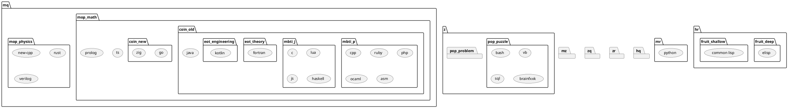

- python
- cpp
- new-cpp
- c
- java
- js
- ts
- go
- sql
- vb
- fortran
- asm
- matlab
- php
- rust
- ruby
- kotlin
- prolog
- verilog
- haskell
- commmon lisp
- elisp
- lua
- ocaml
- bash
- zig

## 编程范式

如果你的面前有一个巨大到你可能难以解决的难题即将来临，你是选择动手强硬地快速解决，还是看着时机船到桥头自然直？

- 前者：命令式
- 后者：函数式
- 看情况：混合式
- 不够难，继续加难度：诡异编程语言

## 类型系统

如果你的面前其实是一头怪兽，你是想用一击毙命但位置不能射错的弓箭杀死它，还是想用灵活但不那么锋利的短剑杀死他？

- 前者：强类型
- 后者：弱类型
- 看情况：中等类型

## mop

你数学和物理两科的成绩哪个高？

- math 数学：高级语言
- physics：物理：底层语言

## eot

你更喜欢工程还是理论？

- engineering 工程：工科常用
- theory 理论：理科常用

## coin

你之前打死的怪兽掉落金币了，你希望得到一个花纹繁复的传统古硬币还是花纹简洁更现代的新硬币。

- old 前者：古老语言
- new 后者：新派语言

## mbti

如果你的面前有一个你喜欢的蛋糕，请问它的上表面是自由随性比较凹凸不平的，还是规则统一具有平滑光泽的？

- p 前者：语法混乱语言
- j 后者：语法统一语言

## fruit

如果你的面前有一个很可口的水果，你希望它来自于丰饶的黄金国度，还是神秘的桃花源中？

- shallow 前者：广泛语言
- deep 后者：小众语言

